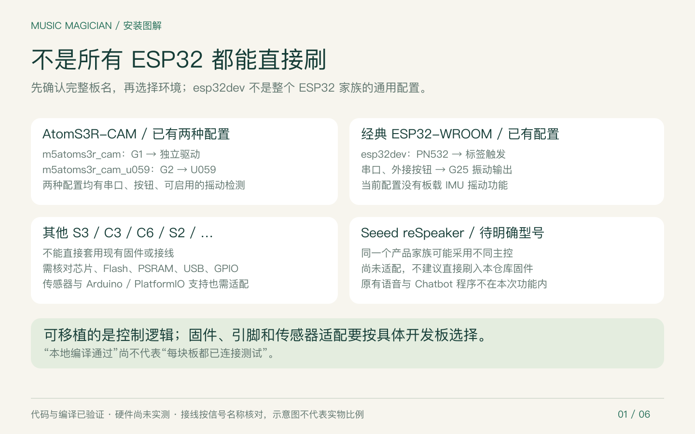
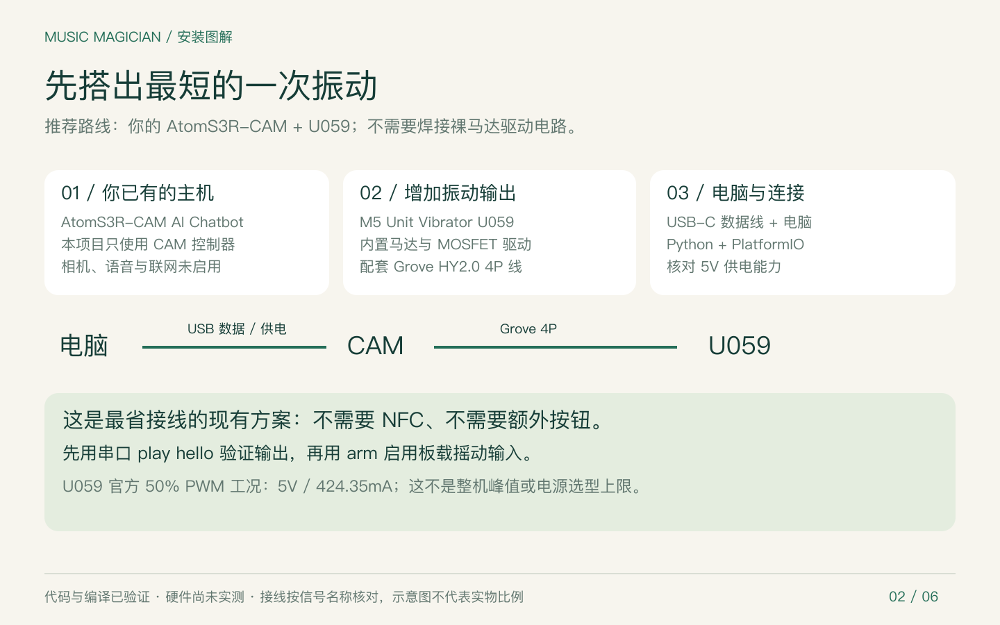
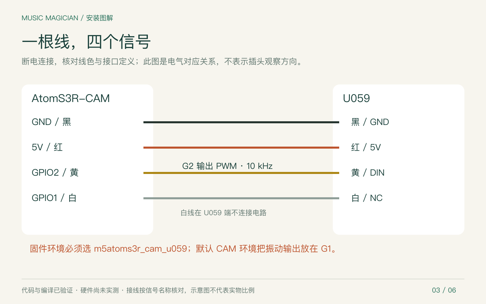
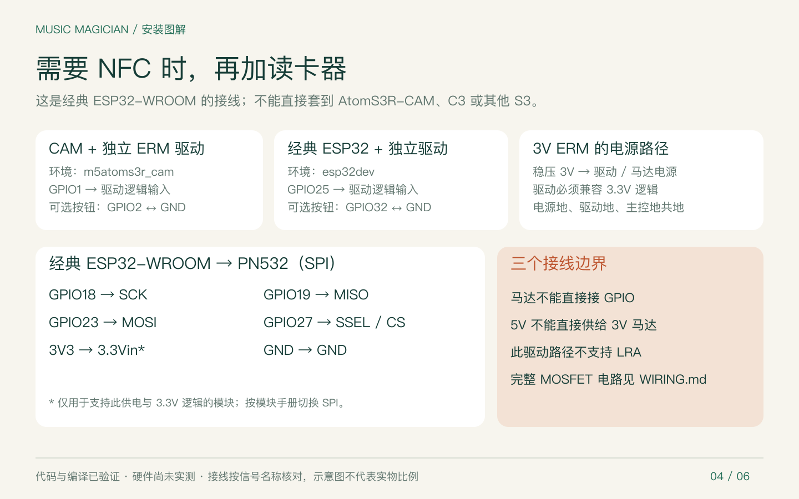
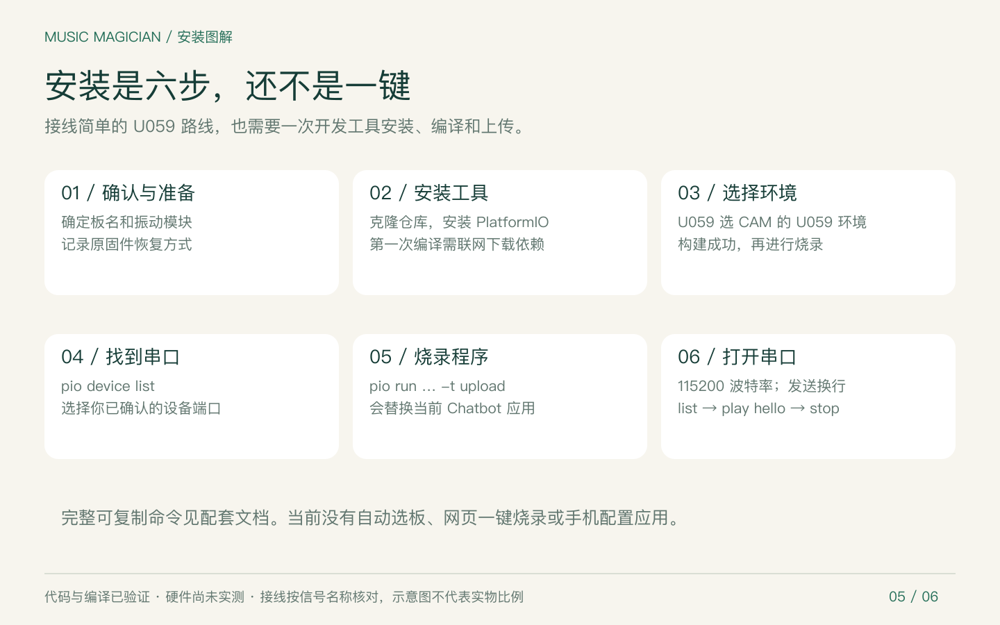
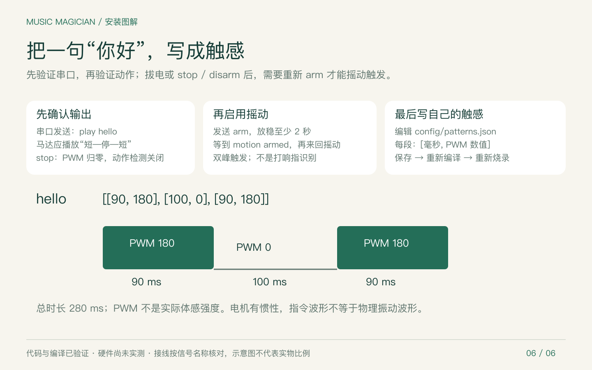

# 从开发板到第一次振动

不是所有 ESP32 都能直接安装同一份固件。本仓库当前是开发者 MVP：有三种已通过本地编译的配置，尚未完成真实硬件验收；没有网页一键烧录、自动选板或手机配置应用。

对已经拥有 **AtomS3R-CAM AI Chatbot** 的用户，接线最少的路径是 **CAM + M5 Unit Vibrator U059 + Grove 线 + USB-C 数据线**。先用串口触发，再启用摇动。首次安装需要配置开发工具、下载依赖、编译和选择串口，不能承诺几分钟即完成。

## 1. 先选对开发板



| 开发板与配件 | PlatformIO 环境 | 本次输出 | 现状 |
| --- | --- | --- | --- |
| AtomS3R-CAM + 独立 ERM 驱动 | `m5atoms3r_cam` | GPIO1，20 kHz PWM | 已本地编译，未实测 |
| AtomS3R-CAM + U059 | `m5atoms3r_cam_u059` | GPIO2，10 kHz PWM | 已本地编译，未实测 |
| 经典 ESP32-WROOM / DevKitC V4 + PN532 | `esp32dev` | GPIO25，20 kHz PWM | 已本地编译，未实测 |
| 其他 ESP32-S3、S2、C3、C6、H2 等板 | 无现成适配承诺 | 需核对引脚与驱动 | 不要直接套用以上固件 |
| Seeed reSpeaker | 具体型号尚未明确 | 待确认 | 未适配 |

“ESP32”是一个家族。可复用的部分是 C++ 振动调度、配置与输入逻辑；具体主控的 Flash/PSRAM、USB、GPIO、Arduino API 和传感器不同。`esp32dev` 只是一种具体板配置，不是万能选项。CAM 配置虽然借用 `esp32-s3-devkitc-1` 板定义，但加入了 CAM 的内存、USB 和传感器设置，不能据此推断任意 S3 适用。

## 2. 准备配件



- 你的 AtomS3R-CAM（AI Chatbot 套装也可以）。
- M5 Unit Vibrator **U059** 与配套 Grove HY2.0 4P 线。
- 能传输数据的 USB-C 线和电脑；充电线可能无法枚举串口。
- Python 3.10+、Git、联网下载开发工具的条件。
- 核对 5V 电源与线材供电能力。U059 官方列出的 50% PWM 工况是 424.35 mA，不代表整机峰值；还需要考虑主控及电机启动负载。

CAM 没有内置振动马达。先记录原有 Chatbot 的配置与恢复固件来源；本仓库不包含原程序备份或恢复工具。

## 3. 断电连接



将 U059 通过 Grove 接入 CAM：黑线 GND、红线 5V、黄线 GPIO2 → DIN、白线 GPIO1 → U059 的 NC。按实际信号定义核对，图中不是插头的物理排列视图。选择 **`m5atoms3r_cam_u059`** 环境。该路线不需要外接按钮。



如果使用裸 3V ERM 马达或 PN532，先阅读 [完整接线与 BOM](WIRING.md)，其中有 MOSFET、续流二极管、共地和电源要求。图 4 是接线索引，不能替代完整驱动电路。经典 ESP32 的 PN532 要切换到 SPI；第三方模块供电与模式开关以其手册为准。

NFC 读的是被动标签 UID；未实现两个设备碰一碰。LRA 需要不同的驱动，本仓库没有实现。

## 4. 安装、编译与上传



以下示例为 macOS / Linux，环境选择针对 **CAM + U059**。若不想使用终端安装 PlatformIO，也可以用 VS Code 的 PlatformIO IDE 打开仓库，选择同名环境执行 Build / Upload；不要另建空白项目。

```sh
git clone https://github.com/alphazen33/music-magician-mvp.git
cd music-magician-mvp
python3 -m venv .venv
.venv/bin/python -m pip install platformio==6.1.18
.venv/bin/pio run -e m5atoms3r_cam_u059
```

首次构建会下载锁定的工具链与依赖。看到该环境 `SUCCESS` 后，再连接开发板并列出串口：

```sh
.venv/bin/pio device list
```

核对插拔前后的设备，确认属于开发板的端口。下面的 `YOUR_CONFIRMED_PORT` 必须替换成实际端口，例如 macOS 的 `/dev/cu.usbmodem...`、Linux 的 `/dev/ttyACM...`；不要原样粘贴占位符。

**上传会替换当前 Chatbot 应用。** 关掉占用同一端口的串口监视器后执行：

```sh
.venv/bin/pio run -e m5atoms3r_cam_u059 -t upload --upload-port YOUR_CONFIRMED_PORT
.venv/bin/pio device monitor -b 115200 --port YOUR_CONFIRMED_PORT
```

上传后端口可能改变；若串口打不开，重新执行 `device list`。串口命令以换行结束；退出 PlatformIO monitor 可用 `Ctrl+C`。

**Windows PowerShell**：使用 `py -3 -m venv .venv` 创建环境；将上面 `.venv/bin/python` 改为 `.\.venv\Scripts\python.exe`，将 `.venv/bin/pio` 改为 `.\.venv\Scripts\pio.exe`。端口通常是 `COM3` 等，以设备列表为准。无需激活虚拟环境。Windows 安装路线尚未在本项目中实测。

其他已适配路线需要把所有编译和上传命令的环境一并替换：独立马达驱动 CAM 用 `m5atoms3r_cam`；经典 ESP32 用 `esp32dev`。不能只换接线、不换环境。

## 5. 第一次使用与自定义



先逐条发送，每条按回车：

```text
list
play hello
stop
```

`hello` 是 90 ms PWM 180 → 100 ms 停顿 → 90 ms PWM 180。串口能够接受命令并不证明马达正常；需要观察实际输出。无实物时可按 [README](../README.md) 运行桌面模拟器，它只显示指令时间线。

CAM 两个配置都支持摇动输入：

```text
arm
```

放稳至少 2 秒，等到 `motion armed`，再做明显来回摇动。检测双峰后播放配置里的 `button_pattern`，默认是 `hello`。这是待实测调参的阈值检测，不是打响指或 AI 手势识别。输入 `stop` / `disarm` 会停止并关闭动作检测；下次需要重新 `arm`。详见 [摇动检测说明](MOTION.md)。

修改 [patterns.json](../config/patterns.json) 中已有 `hello` 对象的 `steps`，不要把示例对象覆盖整个配置文件。`[毫秒, PWM]` 的第二个值为 0 代表停顿。保存后重新编译、上传；当前不能用手机实时编辑。保持原来的配置结构与生成器上限：单段 1–500 ms，PWM 0–230，单模式总长不超过 3 秒、累计通电不超过 1.5 秒。主观体感需要实物校准。

经典 ESP32 的 `learn` 会在本地串口输出下一张标签 UID 一次，将其填入 `tags` 映射后重新烧录。长时间保持标签贴近只触发一次，移开并经过释放时间后才会重新触发。

## 6. 出问题时看这里

| 现象 | 先检查 |
| --- | --- |
| 找不到设备端口 | 换确认支持数据的线；插拔比较列表；按实际 USB 芯片选择官方驱动 |
| 上传连接超时 | 关闭占用端口的软件，核对板型；按对应板官方教程进入下载模式，不套用其他板按键步骤 |
| 串口正常但不振动 | U059 是否选对环境；G2/DIN、5V、GND；独立驱动是否共地、马达电源是否匹配 |
| 一振动就复位／断连 | 停止运行，核对电源瞬态能力、线材压降和驱动接线 |
| 摇动无响应 | 只支持 CAM；是否 `arm` 后等待 `motion armed`；是否报告校准或读取失败 |
| NFC 不识别 | 只在 `esp32dev` 启用；SPI 模式、引脚、模块逻辑电平和标签类型；接回 PN532 后复位 |
| 想恢复聊天机器人 | 按该设备原固件的官方恢复流程；本仓库不会保留并同时运行 Chatbot |

装好后按 [硬件验收清单](HARDWARE_ACCEPTANCE.md) 验证。本文图解不是新的硬件测试记录。

## 图源、复用与依据

六张说明图为本仓库原创矢量图，不是硬件实拍。PNG 用于文档展示，SVG 保留可编辑文字与连线；源文件在 [images](images)。运行 `python3 scripts/build_guide_images.py` 可重新生成 SVG。排版采用 PingFang SC，并指定 Noto Sans SC 作为备用；PNG 固化当前字体显示。未使用生成式位图来绘制电气引脚。

- [兼容性 SVG](images/01-compatibility.svg) · [配件 SVG](images/02-parts.svg) · [U059 接线 SVG](images/03-u059-wiring.svg)
- [其他接线 SVG](images/04-alternative-wiring.svg) · [安装 SVG](images/05-install.svg) · [使用 SVG](images/06-first-use.svg)
- [六图总览](images/overview.png)

核对日期：2026-09-21。仓库能力以 [platformio.ini](../platformio.ini)、[board_pins.h](../include/board_pins.h) 和 [验证记录](../verification/STATUS.md) 为准。外设规格与板定义参考：

- [M5 AtomS3R-CAM 官方资料](https://docs.m5stack.com/en/core/AtomS3R%20Cam)
- [M5 Unit Vibrator U059 官方引脚与供电](https://docs.m5stack.com/en/unit/vibrator)
- [PlatformIO esp32dev 板定义](https://docs.platformio.org/en/stable/boards/espressif32/esp32dev.html)
- [Espressif DevKitC V4](https://documentation.espressif.com/esp-dev-kits/en/latest/esp32/esp32-devkitc/user_guide.html)
